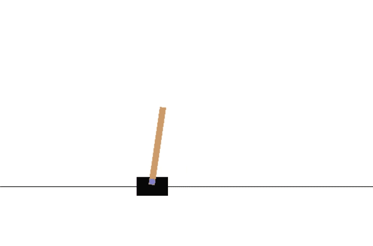

# Reinforcement Learning Balancer
Uses finite-distance REINFORCE policy gradients to perform gradient ascent. 
Rewarding details: for every time step that the algorithm has not failed (the pole has neither fallen nor will imminently fall) the algorithm is given a reward of +1.
</img> 
Requirements: 
TensorFlow 
NumPy 
OpenAI Gym 
